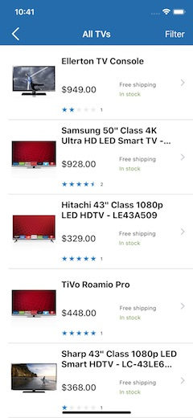
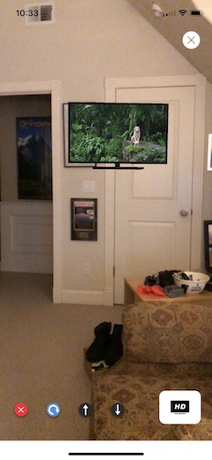

# TV Buying Guide
  

## Overview

The purpose of this app is to help someone buy a new TV.  It is a concept app, not shipping app.

What type of help does a person need when they are trying to buy a tv?

Do they want to just see a list of available TVs?  Is that how their buying process works?  Unlikely.

When you go to a store that sells TVs, you typically don't see every model available.  It's a curated list to make your choices simpler.  Usually they are laid out from small screen size to big with a mix of manufacturers.  An online shopping experience has the benefit of a wider selection but has the resulting impact of more mental load and indecision.

A person probably has some questions like:
- What factors should I consider when buying a new TV?  I haven't bought one in a while.  What is 4K? What is IPS?  Do I need to know these terms?
- If I'm thinking of getting a much bigger TV, how might it look in the room I'm placing it in?
- Can I see a list of TVs sorted by the criterial important to me (once I figure out what I think is important)?
- I don't want to be overwhelmed with too many choices.  What about seeing the ones most other people buy?  Something that is a good proxy for  "safe" choice.


## Comments on the Main View

As I stated above (and you can see in my blog: https://medium.com/@daverothschild), the frame is around what job the person is trying to get done.  When buying a new TV, these four buttons, while not exhaustive, better signal to the user that we are trying to help them find a solution to the job they are trying to get done.  As part of seeking a solution, these seems like four reasonable questions someone might have before buying.

* **Tom's Guide**  The assumption is that you don't buy a TV very often.  It's on your list but you likely don't know what features are important and you don't really trust the Store to tell you the straight story.  So go to an external party, not affiliated with Sam's Club.  
* **See New TV in Your Room**  ARKit in action.  The iOS 11 library seems like a huge win for retail as consumers can much more easily envision what the product looks like in their home setting.  This should increase their emotional desire to buy.

  **Suggestions for using this view:**
  1. Make sure the room you are in has very good lighting.
  2. Tap the See New TV in Your Room button.
  3. When the camera/scene view appears move the phone around so that the ARKit can start to determine the size of the room and the items in it.  Ideally move slowly about 180 degrees from center.
  4. Tap the button in the lower right that says "HD." A popover will appear with two tvs to choose from.
  5. Tap on one of the TVs that you would like to place in the camera scene. There are two to choose from.
  6. Long tap on the camera/scene to place the selected tv in the view.
  7. If successful, you will see 4 controls appear on the bottom left to delete, rotate, move up or move down the tv.
  8. If you tap again another tv will be placed in the view.  Hit the x to delete it.  
  9. You can get in a state where there are many tvs in the view and the delete doesn't work.  (It's software!)
  10. If you don't like the placements, hit the X in the upper right.  You will be back on the main screen.  Tap the Show TV in Your Room again. No need to restart the app.
  11. Yep it needs a tracking rectangle and more stuff. Yes the sizing of the tvs after placement is out of wack on occasion. Just start over.


* **Show New All TVs**  This is the classic list of all the TVs.  The API can retrieve over 6,600 + TVs (not all are TVs as the data is not clean).  There is no search or sort.  The filter button does not work but the real app would surely have one.  The idea of this view is to show that all the data has arrived, is parsed correctly, displayed correctly and laid out correctly.  Tap any cell to see the detail for that item. Once in the detail, swipe left to page to the next item rather than going back to the tableview and tapping another cell. This design used a UIPageViewController for swipping left and right to see the next item in the detail view.
* **See Top Rated TVs**  When shopping online, the user is presented with a huge list of choices.  Various properties are added to indicate preference in an effort to simplify choice.  This button goes a step further and just shows the top rated TVs.  The idea is that when I don't know what to buy, I'll just start with the top rated.  The user does not need to go to the list of everything and then run through some filter UI.  In general, the fewer taps, the better.  Note: the data that shows is not **actually** the top rated TVs.  There is no search API so I just take the first number of TVs from page 0 of the API call.  This allows the concept to be shown.  Tap on a cell and the cell unfolds with more data and a Apple Pay buy button. Tap again to close the fold.  Taping and going to another view controller just adds a slight amount of mental load.  The purpose the the Top Rated view is to simplify and make the choice mentally easier.  Somewhat like walking down the TV isle in a Sams's Club where there are just a few TVs on display with some bullet points of features and a bunch of TVs in boxes right in front.  It cries out: "Just pick one of these."  Also **Apple Pay** is implemented in this view to make it simpler than a cart check out process.


## Other Comments

The app does not get all the data on start.  It lazy loads more items as you start to get towards the end of the Show All TVs view. Rather than waiting for the user to get to the end of the tableview and showing a spinner while a user waits, I implemented pre-fetching the data using the iOS APIs for this.  It also pre-fetches images.

In my read of the one page API documentation, it appeared that totalProducts was the total number of products available from the backend data store.  So I developed the logic to determine how many pages, at 30 items per page, would be needed to get to the end.  And then, handle the end case in the table view.  Upon testing I found that totalProducts is really the total number of pages that have products in the json.  As of this writing in October, that was 224 pages, or about 6.691 products (the last page only has 1 product).  Many of the product elements appear duplicated.  The existing app will handle the 224 pages if the logic checking is removed for the page count.  Right now it checks for 224 products across 30 products per page which require 8 pages.

There are a variety of XCTestCases included in this project.  Take a look.

## Requriements

* You need iOS 11.  This is Swift 4. You might need iPhone 6s or higher for ARkit features.
* **This app includes Apple Pay.  I won't compile without following these instructions**.  You need to do some configuration to avoid provisioning profile errors.  Try slightly changing the bundle ID on the general tab.  Then go the Capabilities tab and go down to Apple Pay. Tap the plus button to add a merchant ID.  The merchant ID starts with "merchant" which is pre-populated in the text field.  Paste in your modified bundle ID and hit ok to set up a new merchant ID.  Test the payment on the simulator.  Take that new merchent ID and change out the existing one in the Constants.swift file.
* Once you have changed the bundle ID, try signing with your provisioning profile.

## Installation of Pods
### Included Libraries via Pods
1. Cosomos - for star ratings views. https://github.com/evgenyneu/Cosmos
2. Kingfisher - for image downloading, caching and management. https://github.com/onevcat/Kingfisher
3. Reachability by Ashley Mills - to handle checking for a network connection and if not there redirecting the user to Settings. https://github.com/ashleymills/Reachability.swift
4. SwiftSpinner - A very nice spinner.  I use it here for to let the user know the data is still loading.  A much nicer approach than the activity indicator in iOS. https://github.com/icanzilb/SwiftSpinner
5. Ramotion Folding Cell - This allows a table cell to unfold in place.  I use it in the top rated view to further simplify the cognitive load on a user.  https://github.com/Ramotion/folding-cell

Please run the Podfile to install the required CocoaPods.  Use terminal to traverse to the directory with the project.  Then,

```
 pod install
```

## Implementation Highlights:

* Swift 4 Decodable Protocol for parsing JSON from the server.
* Networking with URLSession broken down into single responsibility classes.
* Singleton for the data model. Simple struct data model.
* Unit and UI tests with live and mock data tests.
* Storyboard, XIB, auto layout, stack views, segues, scroll view, tableview, page view controller, and animations.
* Whole variety of different assets to support various screen resolutions.  3D SceneKit assets with textures.
* Consistency in navigation, UX, colors and assets.
* Lazy loading of data source object using prefetch rows so data is ready as user scrolling approaches those cells.
* Caching of images for better performance.  Loading of a default image while network requests underway.
* Separate utilities for colors, constants and reachability.
* Apple Pay implemented for simulated purchasing and simplicity of buying process.
* Folding table view cell to reduce user tap through requirements.
* Cell configuration in cell class not view controller.
* UIPageViewController to allow easy swiping (forward and back) through detailed cell data rather than needing to return to the tableview to select another cell and display the detail.
* SFSafariViewController to provide a standard interface for showing a guide for selecting TVs.
* UIPopoverPresentationController to present a simple drop down filter for tableview data.  Also used for selecting a TV to place in augmented reality live view.
* ARKit and SceneKit to demonstrate 3D TV objects in a room. Gesture recognizers to place 3D objects.

---

Attributions
* TV scene kit image was purchased from Turbosquid.com.
* None of the assets in here should be used in a commercial product.
* Icons from icons8.com.


Copyright Dave Rothschild October 2017
